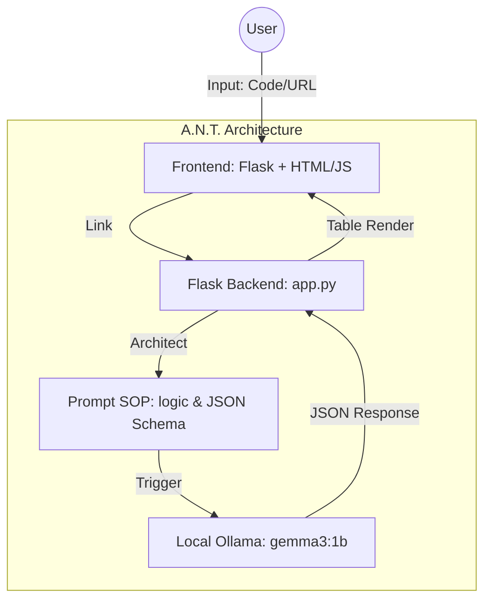

# ⚡ B.L.A.S.T. Local Test Case Generator

A powerful, privacy-first QA automation tool that generates structured test cases using a local LLM (**Ollama**). Built with the **B.L.A.S.T.** (Blueprint, Link, Architect, Stylize, Trigger) protocol.

## 🏗️ System Architecture (A.N.T. 3-Layer)



---

## 🚀 How It Works

1.  **Input Layer**: User enters a code snippet (e.g., a Python login function) or a requirement (e.g., `app.vwo.com`) into the UI.
2.  **Processing Layer**: 
    - The system wraps the input into a specialized **SOP (Standard Operating Procedure)** prompt.
    - It enforces a strict **JSON Schema** to ensure test cases follow the structure: `ID`, `Type`, `Title`, `Preconditions`, `Steps`, and `Expected Result`.
3.  **Inference Layer**: The local **Ollama** instance (`gemma3:1b` or `llama3.2`) processes the prompt offline—no data leaves your machine.
4.  **Display Layer**: The UI parses the JSON output and renders a clean, interactive **Table** showing both Positive and Negative test cases.

---

## 🛠️ Tech Stack & Protocols

-   **Backend**: Python / Flask
-   **Local LLM**: Ollama (Inference Engine)
-   **UI**: Vanilla JS / CSS (Glassmorphism Design)
-   **Security**: 100% Local (Privacy-First)
-   **Protocol**: **B.L.A.S.T.** 
    - **B**lueprint: Requirements defined in `gemini.md`.
    - **L**ink: Connected via Ollama REST API.
    - **A**rchitect: Structured prompt engineering in `architecture/`.
    - **S**tylize: Modern dark-mode UI with table rendering.
    - **T**rigger: Real-time generation upon user submission.

---

## 📦 Setup & Installation

1.  **Install Ollama**: Download from [ollama.com](https://ollama.com).
2.  **Pull Model**:
    ```bash
    ollama pull gemma3:1b
    ```
3.  **Install Dependencies**:
    ```bash
    pip install -r requirements.txt
    ```
4.  **Run Application**:
    ```bash
    python app.py
    ```
5.  **Access**: Open `http://localhost:5000` in your browser.

---

## 📄 License
MIT License - Created for Local QA Automation Excellence.
