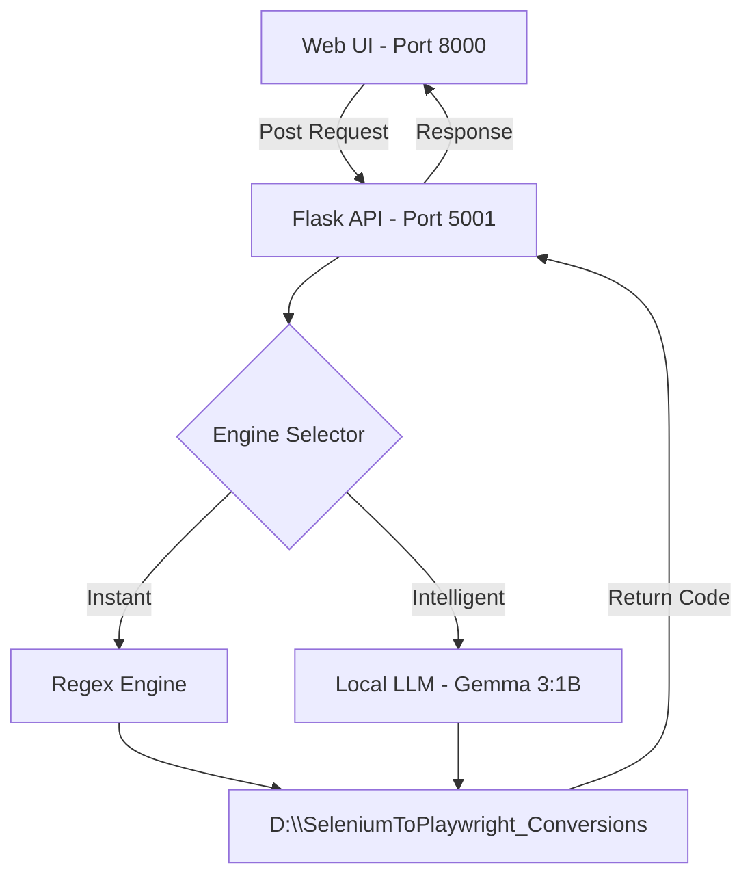

# Selenium to Playwright Converter 🚀

A powerful, hybrid conversion tool designed to migrate Selenium Java (TestNG) suites to modern Playwright TypeScript/JavaScript codebases instantly. It leverages a dual-engine architecture to provide both speed and intelligence.

## 🏗️ Architecture Diagram



## 🌟 Key Features

- **Hybrid Engines**: 
    - **Regex (Instant)**: Zero-lag conversion for standard Selenium commands (locators, clicks, sendsKeys, assertions).
    - **Gemma 3 (AI)**: Local LLM powered by Ollama to handle complex Java logic, conditions, and structural refactoring.
- **Smart Mapping**: Automatically handles `await` injection, translates TestNG hooks (`@Test`, `@BeforeMethod`), and maps Java types to TypeScript.
- **Boilerplate Strip**: Automatically removes Java packages and class definitions to provide clean, executable TS/JS code.
- **Hardware Optimized**: Specifically tuned to run on resource-constrained systems by utilizing lightweight models and external drive storage.

## 🚀 Setup & Installation

### 1. Prerequisites
- **Python 3.10+** (Flask, Requests)
- **Ollama** (For AI features)
- **Node.js** (To run the converted Playwright scripts)

### 2. Implementation Steps

1. **Clone the Repository**:
   ```bash
   git clone https://github.com/shobharatheesh/AITesterBlueprint_Projects.git
   cd Project2_SeleniumToPlaywright
   ```

2. **Start the Backend API**:
   ```bash
   python tools/api.py
   ```
   *The API will run on `http://localhost:5001`*

3. **Start the Frontend UI**:
   ```bash
   python -m http.server 8000 --directory ui
   ```

4. **Access the Tool**:
   Open [http://localhost:8000](http://localhost:8000) in your browser.

## 🛠️ How it Works

### Deterministic Layer (Regex)
The `converter_engine.py` uses advanced regular expressions to map known Selenium patterns directly to Playwright equivalents. This is the fastest method and handles structural wraps (e.g., turning a `public static void main` into a `test()` block).

### Cognitive Layer (AI)
When **Gemma 3 (AI)** is selected, the system sends the code to a local Ollama instance. It uses a specialized system prompt that instructs the model to strip Java boilerplate and follow strict Playwright best practices (locators, async/await).

### Storage & Performance
To handle disk space constraints, the tool is configured to save all converted files to `D:\SeleniumToPlaywright_Conversions` (configurable in `api.py`).

## 📁 Project Structure
- `tools/`: Core conversion logic and API.
- `ui/`: Premium web interface.
- `architecture/`: Conversion SOPs and definitions.
- `conversions/`: Output directory (Redirected to D: drive).
