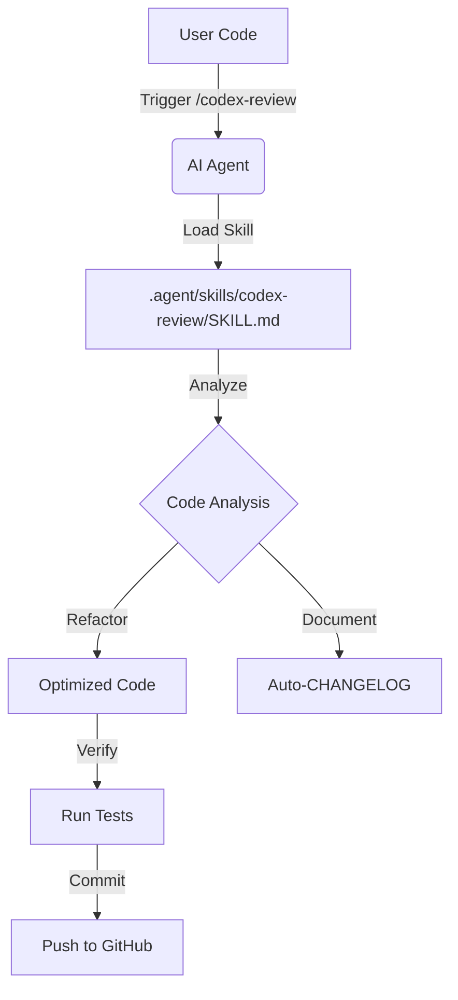

# Project 3: Skills Creator & Codex Review

This project demonstrates the integration of agentic "skills" into the development workflow, specifically focusing on the `codex-review` skill for professional code analysis and automated documentation.

## 🛠️ How it Works

The project utilizes a modular "Skills" architecture. Skills are predefined sets of instructions and patterns that allow the AI agent (Antigravity) to review code, suggest improvements, and ensure best practices.

### 🏗️ Architecture

The system consists of three main components:
1.  **User Code**: The source code (e.g., Playwright tests) that needs review or generation.
2.  **Agentic Skills**: A repository of specialized skills located in `.agent/skills`, providing the AI with specific capabilities.
3.  **Execution Engine**: The environment (Playwright, Node.js) where the code is executed and tested.

#### 🔄 Review Workflow



## 🚀 Setup Instructions

Follow these steps to set up the project locally.

### 1. Prerequisites

-   **Node.js**: Ensure you have Node.js installed (v14 or higher).
-   **VS Code**: Recommended for the best development experience.
-   **Git**: Required for version control.

### 2. Clone the Repository

```bash
git clone <your-repo-url>
cd Project3_SkillsCreator
```

### 3. Install Dependencies

Install the project dependencies, including Playwright:

```bash
npm install
npx playwright install
```

### 4. Configure Agentic Skills

The project relies on a collection of agentic skills. These should be cloned into the `.agent/skills` directory:

```bash
# Create the directory if it doesn't exist
mkdir -p .agent/skills

# Clone the skills repository
git clone https://github.com/sickn33/antigravity-awesome-skills.git .agent/skills
```

> **Note:** If you already have the `.agent/skills` directory populated, you can skip this step.

## 🏃 Usage

### Running Tests

To run the Playwright tests used in this project:

```bash
npx playwright test
```

To run a specific test file:

```bash
npx playwright test tests/google-search.spec.js
```

### Applying Skills

To use the `codex-review` skill, simply mention the skill path or name when interacting with the AI agent:

> "@[.agent/skills/skills/codex-review] review this test file and suggest improvements."

## 📁 Project Structure

-   `tests/`: Contains the Playwright test specifications.
-   `.agent/skills/`: Local database of agentic skills.
-   `playwright.config.js`: Configuration for Playwright tests.
-   `package.json`: Project dependencies and scripts.
-   `README.md`: Project documentation.

## 📈 Example: Selenium to Playwright Migration

In this project, we successfully converted a legacy Java Selenium snippet into a modern, production-ready Playwright test:

1.  **Input:** Partial Java snippet with syntax errors and missing assertions.
2.  **Action:** Applied `codex-review` skill.
3.  **Output:** Clean JavaScript code with Regex assertions and optimized performance.

