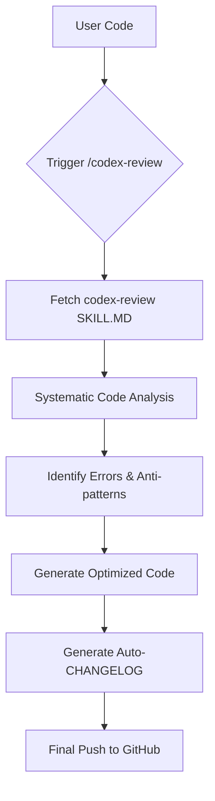

# Project 3: Skills Creator & Codex Review

This project demonstrates the integration of agentic "skills" into the development workflow, specifically focusing on the `codex-review` skill for professional code analysis and automated documentation.

## 🛠️ How it Works

The project utilizes a modular "Skills" architecture. Skills are predefined sets of instructions and patterns that allow the AI agent (Antigravity) to perform specialized tasks with high precision.

### 🔄 Review Workflow



## 🚀 Setup Instructions

### 1. Repository Structure
The skills repository is cloned into a special hidden directory to keep the workspace clean while remaining accessible to the agent.

```bash
git clone https://github.com/sickn33/antigravity-awesome-skills.git .agent/skills
```

### 2. Skill Configuration
The `codex-review` skill is located at:
`.agent/skills/skills/codex-review/SKILL.md`

It contains instructions for:
- Professional syntax checking.
- Performance optimization.
- Best practice enforcement (e.g., adding assertions to tests).
- Automated changelog generation.

### 3. Usage
Simply mention the skill or the directory path when asking for a review:
> "@[.agent/skills/skills/codex-review] review this Playwright test"

## 📈 Example: Selenium to Playwright Migration
In this project, we successfully converted a legacy Java Selenium snippet into a modern, production-ready Playwright test:

1. **Input:** Partial Java snippet with syntax errors and missing assertions.
2. **Action:** Applied `codex-review` skill.
3. **Output:** Clean JavaScript code with Regex assertions and optimized performance.

## 📁 Project Structure
- `tests/`: Contains the optimized Playwright specifications.
- `.agent/skills/`: Local database of 600+ agentic skills.
- `.gitignore`: Configured to exclude heavy skill assets while tracking core logic.
