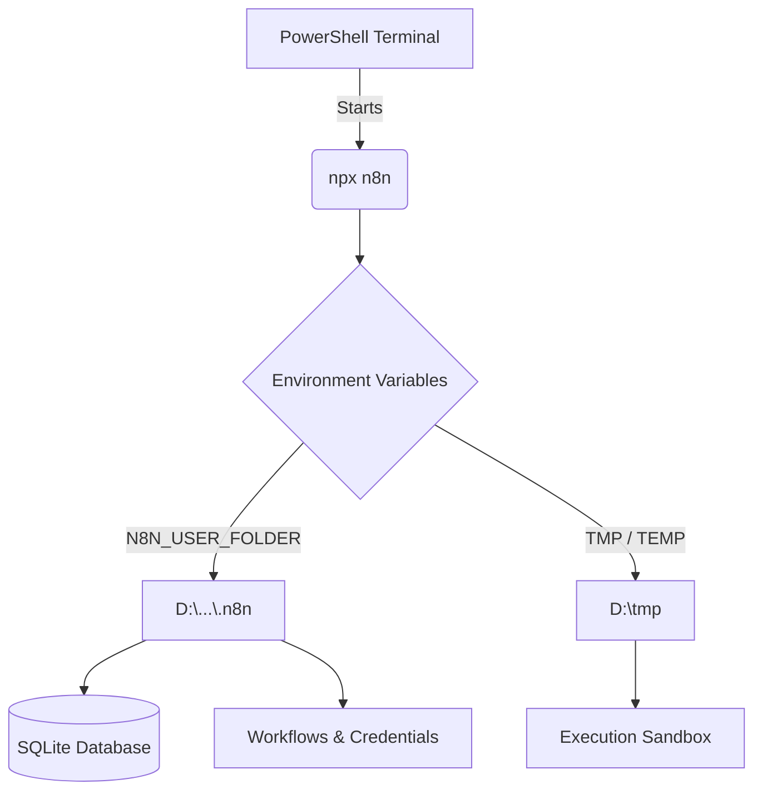

# ⚙️ Project 5: n8n Learning & Setup (Space-Optimized)

[](https://n8n.io)
[](https://opensource.org/licenses/ISC)
[](#)

This project serves as a comprehensive guide and environment for mastering **n8n**, specifically tailored for **AI Tester Blueprint** workflows. It is architected to operate efficiently on systems where the primary drive (C:) is constrained, leveraging secondary storage (D:) for all heavy lifting.

---

## 🎨 Design Philosophy
The core objective of this project is to provide a **portable, high-performance automation engine** that doesn't compromise system stability. By redirecting all volatile and persistent data to the D: drive, we ensure that n8n can handle complex JSON payloads and large binary files without triggering "Disk Full" errors on the OS drive.

## 🚀 Key Features

*   **⚡ High-Speed Inference**: Optimized for connecting with **Groq** for lightning-fast LLM responses.
*   **🔒 Local First**: Deep integration with **Ollama** for privacy-focused, offline AI task execution.
*   **💾 Smart Storage**: Zero-footprint on C: drive. All cache, temp files, and databases are strictly maintained on the D: drive.
*   **🤖 AI Blueprint Ready**: Specifically configured to support the B.L.A.S.T protocol (Business Logic, Analysis, Scripting, Testing).

---

## 🏗️ How It Works (Architecture)



1.  **Environment Injection**: Upon startup, specific environment variables redirect the default folders.
2.  **Data Persistence**: The `.n8n/` directory acts as the "brain," housing the SQLite database, encrypted credentials, and workflow JSONs.
3.  **Resource Isolation**: By setting `$env:TMP` to the D: drive, n8n has access to gigabytes of swap space for large workflow executions, preventing standard "Node.js heap limit" or "Disk full" crashes.

---

## 🛠️ Installation & Setup

### 1. Prerequisites
*   **Node.js**: v18 or later recommended.
*   **D: Drive**: Ensure you have at least 5GB of free space.
*   **Temp Folder**: Manually create `D:\tmp` if it doesn't exist.

### 2. Initial Setup
Clone this repository and install dependencies using a custom cache location:
```powershell
npm install --cache D:\npm-cache
```

### 3. Running n8n
Execute the optimized start command:
```powershell
# Set environment and start
$env:TMP="D:\tmp"; $env:TEMP="D:\tmp"; $env:N8N_USER_FOLDER="d:\AITesterBlueprint\Project5_n8nLearning\.n8n"; npx n8n start
```

---

## 📁 Project Structure

| File/Folder | Purpose |
| :--- | :--- |
| `.n8n/` | Persistent storage for the local n8n instance (Workflows, Binary Data, DB). |
| `credentials.md` | Secure reference for login management (Internal use only). |
| `.gitignore` | Configured to exclude heavy binaries and the local SQLite database. |
| `package.json` | Project metadata and n8n dependency versioning. |

---

## 🤖 AI Model Ecosystem

| Tool | Integration Type | Best For |
| :--- | :--- | :--- |
| **Groq** | API-Based | Bulk test case generation, complex logic analysis. |
| **Ollama** | Local Socket | Generating sensitive PII test data, offline development. |

---

## ⚠️ Maintenance Notes
*   **Clear Cache**: Periodically check `D:\npm-cache` if space becomes an issue.
*   **DB Backup**: Copy the `database.sqlite` file inside `.n8n/` periodically.
*   **Credential Security**: Never commit the `.n8n/config` or `credentials.md` to public repositories.

---

> Created with ❤️ for the AI Tester Blueprint community.
